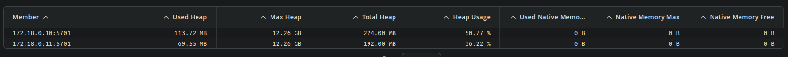

# SA-Lab-2

## 1-2 Docker setup

**Create network**
```
docker network create --subnet=172.18.0.0/16 hazelcast-network
```

**Container 1**
```
docker run --rm -v "$(pwd)"/hazelcast-docker.xml:/opt/hazelcast/hazelcast-docker.xml \
  -e HAZELCAST_CONFIG=hazelcast-docker.xml \
  --network hazelcast-network \
  --ip 172.18.0.10 \
  --name member1 \
  -p 5701:5701 \
  hazelcast/hazelcast:latest
```


**Container 2**
```
docker run --rm -v "$(pwd)"/hazelcast-docker.xml:/opt/hazelcast/hazelcast-docker.xml \
  -e HAZELCAST_CONFIG=hazelcast-docker.xml \
  --network hazelcast-network \
  --ip 172.18.0.11 \
  --name member2 \
  -p 5702:5701 \
  hazelcast/hazelcast:latest
```

**Container 3**
```
docker run --rm -v "$(pwd)"/hazelcast-docker.xml:/opt/hazelcast/hazelcast-docker.xml \
  -e HAZELCAST_CONFIG=hazelcast-docker.xml \
  --network hazelcast-network \
  --ip 172.18.0.12 \
  --name member3 \
  -p 5703:5701 \
  hazelcast/hazelcast:latest
```

**Managment center:**
```
docker run --rm --network hazelcast-network -p 8080:8080 hazelcast/management-center 
```


## 3. Distributed Map

**Python code:**\


**Output:**\


**Managment center statistics::**\


### Clusters removing(`kill -9 <pid>`):
- 1 cluster:   


    - no data loss
    

- 2 clusters sequentially:


    - data loss
    

- 2 clusters simultaneously:


    - data loss
    

**Так, втрата даних є.**

Шляхи уникнення втрати даних:
- use back-up copies
- enable persistance

## 4. Distributed Map without locks


## 5. Distributed map with pessimistic locks 


## 6. Distributed map with optimistic locks


## 7. Compare results
**Без блокувань спостерігаються втрати даних.\
Оптимістичний та песимістичний блокування працюють приблизно однаково, з незначною перевагою в сторону песимістичного.**

## 8. Bounded Queue
**Створити Bounded-Queue**

**Заранити 1 producer  і 2 consumer's**

Значення вичитуються послідовно.